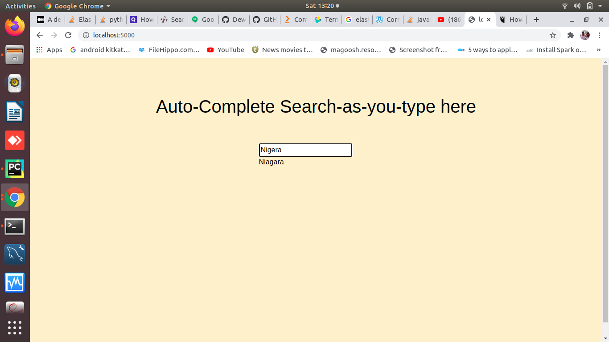

# AutoCorrection using Flask, ElasticSearch

`Our goal is to design an AutoCorrection system the same as Google search engine. 
`
* Before Going to step1 we have stored the data in elastic search with the index name emp11.

**Step 1:**  First we need to write a query in backend using Elastic Search, for autocorrection I used a fuzzy query.
Using Flask I have generated an API for running the elasticsearch query in the backend.

**Step 2:** In the Frontend I have used Flask, Jquery and Ajax 
* In app.py I have created a method inside the flask app in which i have given a url of the backend 
* along with a route for requesting data from the query result from the backend.

* Using Jquery I wrote  a function and inside the function  there is a Ajax method in which 
I have requested a method in app.py using POST, Such that when the user types anything in the searchbox 
in web UI then the Ajax will request the method in app.py and from app.py the POST request will send to backend 
and it will collect the result and display the suggestion on the screen.

**step 3:** In this step first we have to run the api.py for running backend query and afterthat 
run app.py.

**output:**

